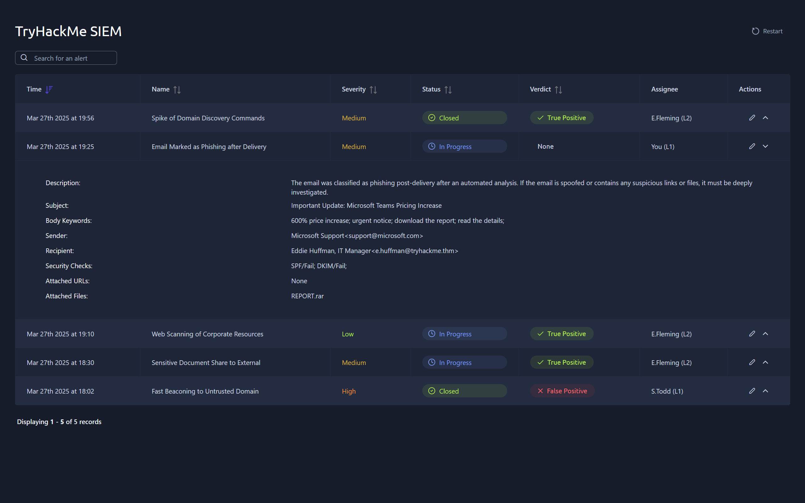
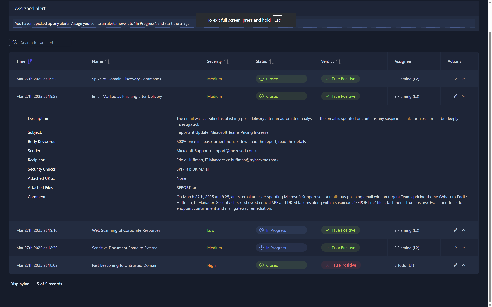
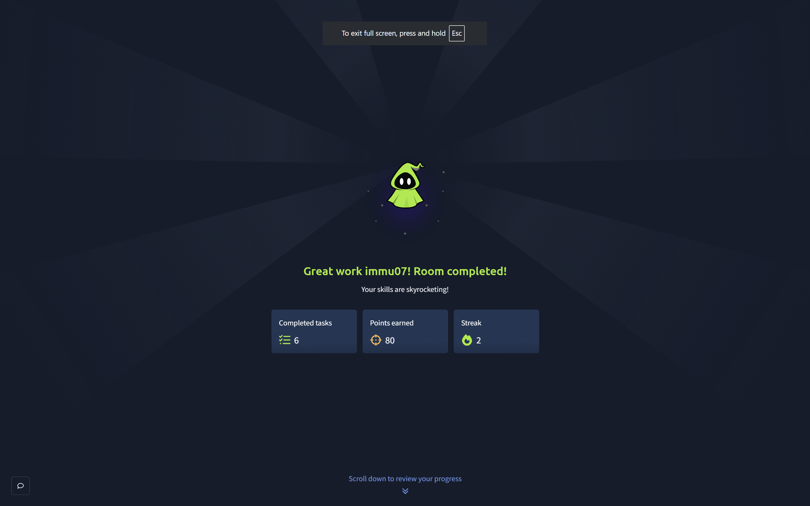

# TryHackMe: SOC L1 Alert Reporting Write-up

## 🎯 Room Overview
This repository contains my step-by-step documentation, analysis, and proof of completion for the **SOC L1 Alert Reporting** room on TryHackMe. This hands-on lab simulates real-world Security Operations Center (SOC) environments, focusing on how a Tier 1 Analyst processes, reports, escalates, and communicates critical security incidents.

*   **Room Link:** [TryHackMe - SOC L1 Alert Reporting](https://tryhackme.com/room/socl1alertreporting)
*   **Role Focus:** Tier 1 SOC Analyst / Incident Triage Specialist

---

## 🛠️ Detailed Walkthrough & Investigation Steps

### 🗒️ Task 1: Introduction to Alert Lifecycle
Understanding the foundational role of a SOC Analyst, how security alerts are generated from raw logs, and the operational workflows needed to maintain continuous infrastructure visibility.

---

### 🌪️ Task 2: Managing the Alert Funnel
This phase demonstrates how millions of raw events are aggregated, cross-referenced against security signatures, and filtered down into actionable alerts to minimize alert fatigue.

---

### 📝 Task 3: Incident Reporting Guide
Hands-on structuring of technical and executive notes. This phase covers writing clear summaries, documenting timestamps, mapping out Source/Destination artifacts, and providing a baseline technical narrative for senior responders.

---

### 📈 Task 4: Standard Escalation Matrix
Analyzing specific alert thresholds to understand exactly when an anomaly needs a deeper dive, and when to confidently escalate it to Tier 2 Analysts or specialized Incident Response teams.

---

### 💬 Task 5: SOC Communication Protocol
Practicing secure, operational communication (OpSec) channels, handling verbal handovers during shift changes, and documenting remediation notes within internal communication ticketing channels.

---

### 🏆 Task 6: Room Completion & Conclusion
Final submission of reports, validation of simulated alerts, and 100% completion badge confirmation.

---

## 🧠 Core Competencies Exhibited
*   **Log Correlation & Triage:** Ability to pull relevant artifacts (IPs, Hashes, Timestamps) from raw alerts.
*   **Operational Communication:** Writing clear, concise, and professional handovers free of ambiguity.
*   **Incident Framework Mapping:** Documenting anomalies using structured templates ideal for auditing and fast remediation.
