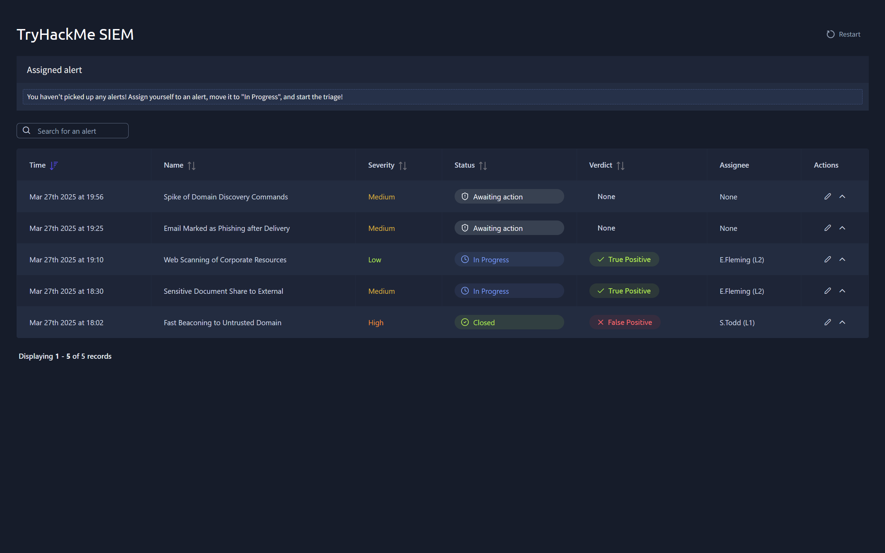
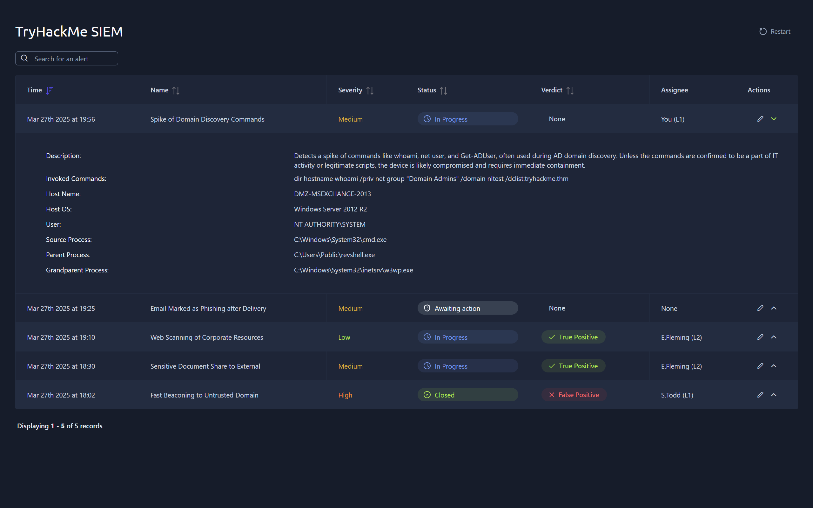
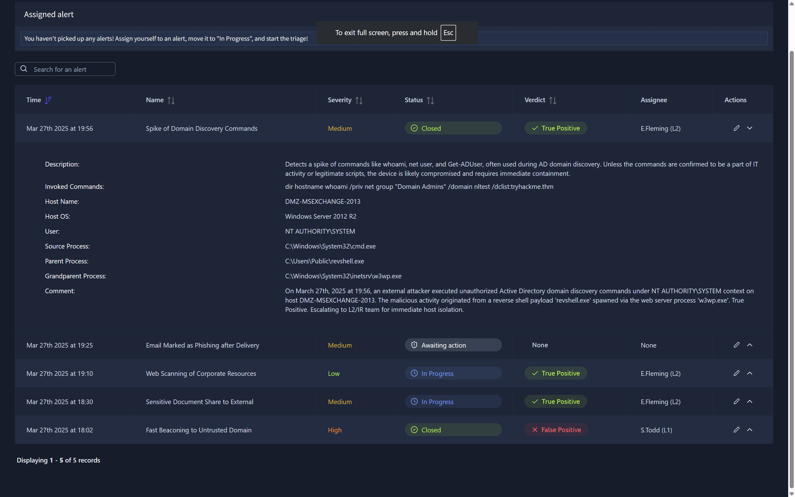

# TryHackMe: SOC L1 Alert Reporting Write-up

## 🎯 Room Overview
This write-up covers my hands-on experience in the **SOC L1 Alert Reporting** room on TryHackMe. This scenario-based room focuses on the core responsibilities of a Tier 1 SOC Analyst: analyzing security alerts, triaging events using analytical frameworks, and generating structured incident reports.

*   **Room Link:** [TryHackMe - SOC L1 Alert Reporting](https://tryhackme.com/room/socl1alertreporting)
*   **Core Concepts:** Alert Triage, Log Investigation, Incident Documentation, Reporting Frameworks.

---

## 🛠️ Tools & Frameworks Used
*   **SIEM / Log Analysis Tools:** Mock alert interfaces and security log outputs.
*   **Documentation Frameworks:** Structured incident reporting templates.

---

## 🚀 Investigation Methodology & Steps

### Step 1: Initial Alert Triage & Analysis
The first phase involved analyzing incoming alerts within the simulated environment. I evaluated critical parameters such as event frequency, source/destination signatures, and contextual details.

### Step 2: Investigating the Artifacts
Deep dived into the logged artifacts to identify potential indicators of compromise (IoCs). This involved tracing connections and looking for suspicious behavior patterns.

### Step 3: Determining Verdict & Generating the Report
Based on the evidence collected during the investigation, a final verdict was established (True Positive / False Positive) and compiled into a formal report.

---

## 🧠 Key Takeaways & SOC Skills Demonstrated
*   **Alert Lifecycle Management:** Gained practical understanding of how an alert flows from detection to triage.
*   **Effective Documentation:** Mastered the art of writing concise, actionable technical notes.
